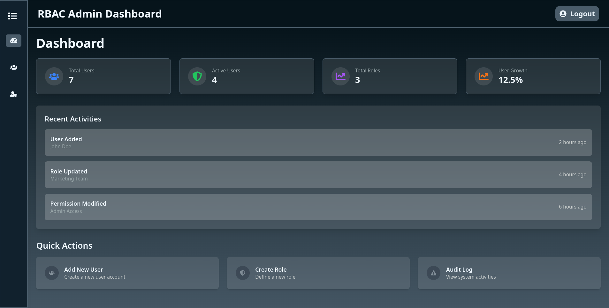
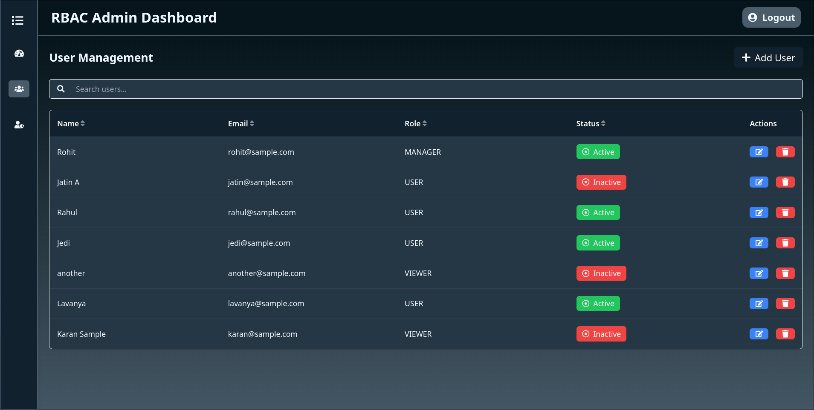
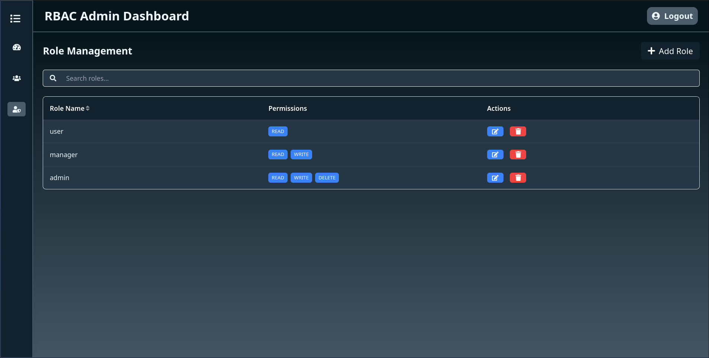
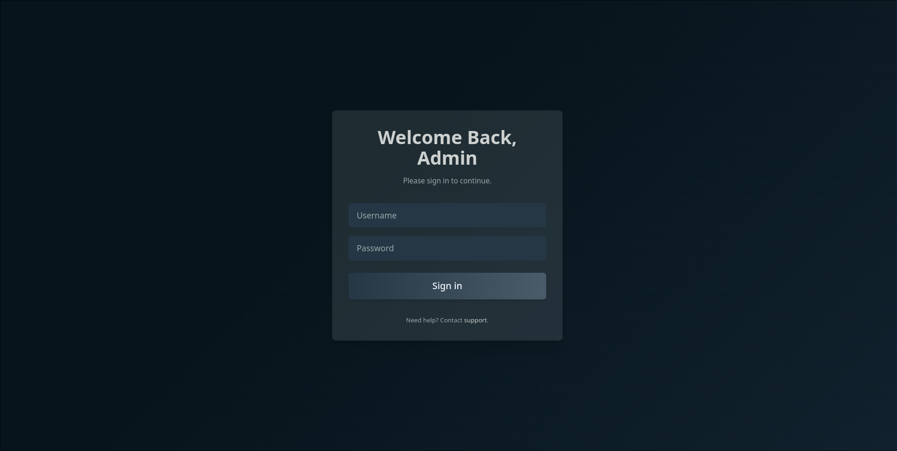

# Role-Based Access Control (RBAC) UI

This project is an assignment for a front-end internship application at **VRV Security**. It demonstrates a **Role-Based Access Control (RBAC)** system with a user-friendly interface to manage users, roles, and permissions efficiently. The application is built using **React**, **TypeScript**, and **TailwindCSS**, showcasing modern design principles and robust functionality.

## Features

### **1. User Management**

- View the list of users with their roles and status (e.g., Active/Inactive).
- Add new users with attributes like name, email, and assigned roles.
- Edit existing user details and their role assignments.
- Delete users while ensuring proper validation.
- Assign or remove roles dynamically to/from users.

### **2. Role Management**

- Define new roles and edit existing ones.
- Associate roles with specific permissions (e.g., Read, Write, Delete) or custom attributes.
- Provide clear visibility of all roles and their associated permissions.

### **3. Permissions Management**

- Dynamic handling of permissions associated with roles.
- Modify and assign permissions to roles in a structured and intuitive manner.
- Ensure roles have appropriate scopes for the users assigned to them.

### **4. Mock API Integration**

- Simulates API calls for CRUD operations on users and roles.
- Mock server responses are included to validate functionality without relying on a backend.
- Fully customizable endpoints for testing API interactions.

### **5. Modern Design**

- Intuitive and visually appealing UI designed using **TailwindCSS**.
- Fully responsive layout optimized for both desktop and mobile.
- Uses contexts to manage state for users and roles seamlessly.

## Technologies Used

- **React**: For building the UI components and managing the application logic.
- **TypeScript**: Ensures type safety and robust development.
- **TailwindCSS**: Provides utility-first CSS for fast and flexible styling.
- **Vite**: For fast and efficient development and bundling.
- **Mock Server**: Simulates a backend for testing API interactions without deploying a server.

## Installation and Setup

### Prerequisites

Ensure you have the following installed:

- **Node.js** (>= 14.0.0)
- **npm** (>= 7.0.0)

### Steps

1. Clone the repository:

   ```bash
   git clone <repository-url>
   cd rbac-ui
   ```

2. Install dependencies:

   ```bash
   npm install
   ```

3. Start the mock server:

   ```bash
   npm run start:mock
   ```

4. Start the development server in another terminal instance:

   ```bash
   npm run dev # username: admin, password: admin123
   ```

5. To build for production:

```bash
npm run build
```

## Directory Structure

```text
├── public
├── README.md
├── src
│   ├── apis              // Contains mock API implementations
│   ├── assets            // Images, icons, and other assets
│   ├── components        // Reusable UI components (e.g., Modal, Table)
│   ├── contexts          // Contexts for managing users and roles
│   ├── pages             // Main pages for the application
│   ├── types             // TypeScript type definitions
│   ├── App.tsx           // Root React component
│   ├── routes.tsx        // Defines application routes
│   ├── main.tsx          // Entry point for the app
│   ├── App.css           // Global CSS
│   └── index.css         // TailwindCSS configuration
├── tailwind.config.js     // Tailwind configuration
├── package.json           // Project dependencies and scripts
├── vite.config.ts         // Vite configuration
└── tsconfig.json          // TypeScript configuration
```

## Mock API Usage

The mock API simulates CRUD operations for:

- **Users**: Add, update, delete, and retrieve user data.
- **Roles**: Create, modify, delete, and list roles.
- **Permissions**: Assign or modify permissions linked to roles.

Start the mock server with:

```bash
npm run start:mock
```

You can find API configurations and endpoints in the `src/apis` directory.

## Contexts

### **User Context**

Handles all user-related state and operations:

- Fetch users from the mock API.
- Add, edit, or delete users.
- Assign or remove roles from users.

### **Role Context**

Manages the roles in the system:

- Fetch roles from the mock API.
- Define new roles or edit existing ones.
- Handle permissions dynamically for roles.

## Screenshots

### **Dashboard**

A clean and organized interface to manage users and roles effectively.


### **User Management**

Add, edit, and delete users with an intuitive modal-based UI.


### **Role Management**

Define roles with specific permissions and attributes.


### Login

Login screen with basic authentication for accessing the dashboard.


## TODOs

1. **User Management:**

   - [x] Provide a way to view and manage users.
   - [x] Include options to add, edit, or delete users.
   - [x] Enable assigning roles to users and managing their status (e.g., Active/Inactive).

2. **Role Management:**

   - [x] Create a way to define and edit roles.
   - [x] Allow roles to include permissions (e.g., Read, Write, Delete) or custom attributes.

3. **Dynamic Permissions:**

   - [x] Design a method to assign or modify permissions for roles.
   - [x] Display permissions clearly for ease of understanding and modification.

4. **Custom API Simulation:**
   - [x] Mock API calls for CRUD operations on users and roles.
   - [x] Simulate server responses to validate functionality.

## Deployment

To deploy the application for production, use the following commands:

1. Build the project:

   ```bash
   npm run build
   ```

2. Serve the `dist` folder using any static file server (e.g., `serve` or `http-server`).
